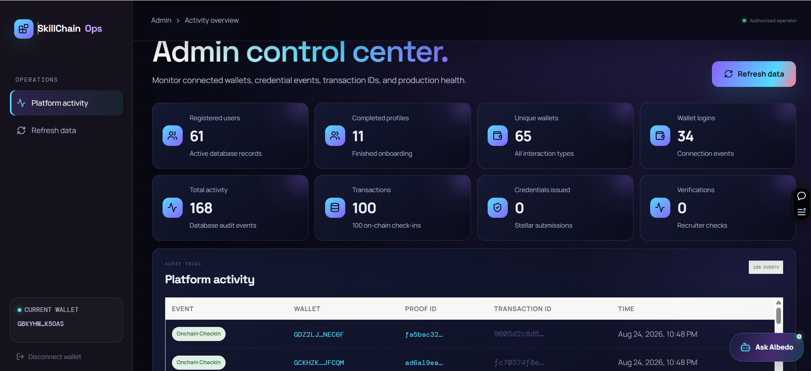
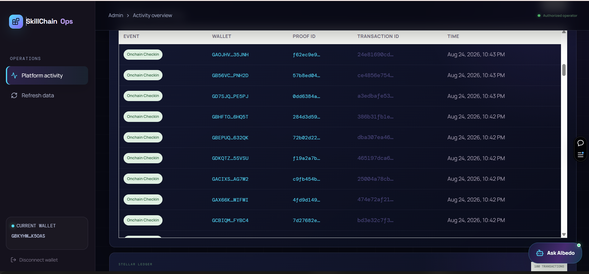

<h1 align="center">SkillChain AI</h1>

<p align="center">
  <strong>AI-powered technical skill verification and portable on-chain credentials on Stellar.</strong>
</p>

<p align="center">
  <a href="https://skill-chain-ai-cona.vercel.app/"></a>
  <a href="https://stellar.org"></a>
  <a href="https://github.com/AmitabhDey-byte/SkillChain_AI/actions/workflows/ci-cd.yml"></a>
  <a href="https://soroban.stellar.org"></a>
</p>

<p align="center">
  <a href="#project-overview">Overview</a> • <a href="#screenshots">Screenshots</a> • <a href="#product-surfaces">Product</a> • <a href="#stellar-credential-contract">Contract</a> • <a href="#local-development">Setup</a>
</p>

---

## Table of Contents

- [Project Overview](#project-overview)
  - [Current Milestone](#current-milestone)
  - [Deployment & Contract](#deployment--contract)
- [Screenshots](#screenshots)
- [Demo Video Link](#demo-video-link)
- [PPT / Pitch Deck](#ppt--pitch-deck)
- [The Users Logged In and Used](#the-users-logged-in-and-used)
- [User Feedback](#user-feedback)
- [Local Development](#local-development)
- [Environment Variables](#environment-variables)
- [Backend Foundation](#backend-foundation)
- [Database](#database)
- [Continuous Integration](#continuous-integration)
- [Vercel Deployment](#vercel-deployment)
- [Product Surfaces](#product-surfaces)
- [Marketplace](#marketplace)
- [Albedo Assistant](#albedo-assistant)
- [GitHub Integration](#github-integration)
- [AI Assessment](#ai-assessment)
- [Wallet Authentication](#wallet-authentication)
- [On-chain Check-in](#on-chain-check-in)
- [Stellar Credential Contract](#stellar-credential-contract)
- [User Onboarding](#user-onboarding)
- [User Dashboard](#user-dashboard)
- [Security Controls](#security-controls)
- [Cost Controls](#cost-controls)

---

## Project Overview

### Current milestone

The application includes role-specific React workspaces, signed Freighter and Albedo wallet sessions, GitHub evidence analysis, Gemini skill assessment, Stellar credentials, GitHub-free on-chain check-ins, a searchable opportunity graph, PostgreSQL-backed profiles and applications, hiring intelligence, and the Albedo blockchain assistant.

### Deployment & Contract

| Resource | Value |
| --- | --- |
| Contract Deployment Address | `CCQ73TUQ3P5QBV3MJHRFDWI2LLHY3GQEKWLRHIOTRZAXNVQEEB57HVWI` |
| Deployed URL | [https://skill-chain-ai-cona.vercel.app/](https://skill-chain-ai-cona.vercel.app/) |

---

## Screenshots

### Product UI


### Mobile Responsive Design


### Admin Panel


### Screenshots of analytics or transaction activity

#### Analytics overview



#### Transaction activity



### 📊 User Onboarding Data

The following 69 consent-based onboarding records demonstrate real Stellar wallet connections and early product feedback. 50 entries include independently verifiable Stellar testnet transaction proofs. Email addresses and phone numbers are intentionally excluded from this public repository.

| Joined (IST) | Participant | Stellar Testnet Wallet | Product Feedback | Testnet Transaction |
| --- | --- | --- | --- | --- |
| 7/18/2026 22:41:34 | Debansh Tiwari | `GA4SXARZZ4RPF6N7VOAH3B5OKMFAP3FGY6M6TO3DZJL4TMU2KOVBHCIY` | The overall experience is smooth. Liked the product! | — |
| 7/18/2026 22:46:13 | Souvik Mandal | `GDDO6MEIVRZTXCJWLPPQAKTIWTD6CLOTGLJBQY63KMOIYASKXNU6WXN5` | Liked the idea. Amazing UI/UX. Make a walkthrough or documentation of user guide that will be very helpful for new user. 👍 | — |
| 7/18/2026 22:46:38 | Ansh Raj | `GA3EHDIPTPLQTQESCNR4TSJYBSERD57KERCNFHGWEJ5OX2XSWTMJO424` | its really good | — |
| 7/19/2026 13:19:54 | pritam dev | `GATJMD6BGNK4FQYNFWB354N7RP4XHA2R74GNSYM472ALNLJFX7NXBS3X` | awesome product | — |
| 7/20/2026 0:27:56 | Lohit Mishra | `GDYWYDOBPPM2XFQS2N7OA2XYO66C24OSBDGASSYAU7V3V4UHFIQYWCRL` | Ui is great on opportunity server error are occurring | — |
| 7/20/2026 17:46:57 | Sk Jishan Uddin | `GAVVOOVYGE7QEJWQO2BZZBGYYSFQPBC3QAYWRC6AFP7E3UMCWFT6YC4U` | Very Very Good , I have not seen any kind of website before , very user friendly to use | — |
| 7/21/2026 12:52:57 | Ritesh Gupta | `GDFSDPEEBZYQVG5JPPTJUOH4FID4M5XV45BKTWCIEIRYMCWJ6DQADBMB` | yup | — |
| 7/21/2026 13:16:51 | Priyanka Mondal | `GCKMODNZEAI4X6AL6SL77PNJLUUJAQAWECXDTXJZGXBOSSSF7THC3XH6` | better product than other in market | — |
| 7/21/2026 13:17:59 | Ritam Saha | `GACMLTEWZ23NGJ5WZ2THYGLODFYTEKECB7J2U33H3DCSW2PEAQUEIZED` | Good | — |
| 7/21/2026 15:17:52 | Elijah Negasi | `GAXCXDDP44VRDTL2PJI22WJU6H4CMRMI2CHRJGPJ3S3L4R323ETDOCAL` | amazing! | — |
| 7/21/2026 16:17:51 | Rishikesh Singh | `GCO222KICSTS24BWPBEOSYQG5L3RAN4KHII7CE2CW36HRHRXQQPC6OCB` | I really like the ui and credential hashing | — |
| 7/21/2026 16:25:01 | Nitin Raj | `GARRE4DTEUJIQSXRACCL6X55RH42S7WBO32F5HB4DU32MT6IL5TL3B3N` | Great experience! Clean UI, easy to use, and a promising platform for AI-assisted learning. The interface is easy to navigate, and the overall workflow feels smooth and engaging. | — |
| 7/21/2026 17:30:33 | Sadiya Mulani | `GBTCGV43NLHEEBMCA5DWFZT6GOJYYCPHXNOEALTBQ7TREIQKQQAVLYT4` | Cool concept. AI-verified, wallet-owned skill credentials on Stellar tackles a real trust problem in a fresh way. | — |
| 7/21/2026 18:54:32 | Ankush Shaw | `GBBIG4HLPGTLG6BH6YREVWJXEQ4NX74HTD444JD6A6XYS7DOFL2J6DEI` | the main feature i liked was ui, how clean it looks and everything is so simple | — |
| 7/21/2026 20:06:28 | Subhadip Dutta | `GAVNLCS3GSWLKXSLZ3ITSL7QNB5IGHEOELXAF6QTYACDLEJ7XRQKBBNO` | Very nice ui and the idea is quite innovative | — |
| 7/21/2026 22:13:03 | Arya Bhagat | `GCNZDOHRGJLUKX53TR5PETCO7Q3BKKWVS5K5GQ3NPFZYQ4MKY2BK6A32` | its a good project to start with | — |
| 7/21/2026 23:05:03 | Aditya Jha | `GAG3SUKHIF7VAWGTDRH52XETMLZXXNXBAZLLXHSLXAQPOBBCN43YLKR4` | I like the product its nice. But needed more work on UI. | — |
| 7/23/2026 0:05:02 | Sandipan Singh | `GDYIHXTUKLCPZHWGGD5B5ZPJZINZ3WUNC3PJCDAYEB4XY4LT2XNTQHTX` | Its pretty good, like it.. keep it up scale it | — |
| 7/23/2026 13:06:47 | ankita barman | `GCV5X5CKYUAPQLE3OYQS3PDXKX4TRV767YUCJ66PWWGZD2BXE744T276` | Good | — |
| 8/22/2026 12:39:05 | Anirban Chakraborty | `GAFA2O72V23LV7WMTT774EHLBGLV7ETLOSG63TLJ6RWZT7FGUV4TM7ZZ` | bhai tui to kore cholechish. keep it up | [`845f3cbac42942212070c3a8c15f5f3ebc667a5f7c55df78634dfb95f7bf6f7c`](https://stellar.expert/explorer/testnet/tx/845f3cbac42942212070c3a8c15f5f3ebc667a5f7c55df78634dfb95f7bf6f7c) |
| 8/23/2026 13:22:15 | Swastika Chatterjee | `GB5YELQUQHJQHSGQP4FD6DC6YTGBT4LF7DHXAHU6GCAHKU4MAX2GOZPT` | dammn...it looks good but need to have more companies | [`cd568412107aa05870cfa767d6d7ee1c1c980e48036c18045862512199c78bc3`](https://stellar.expert/explorer/testnet/tx/cd568412107aa05870cfa767d6d7ee1c1c980e48036c18045862512199c78bc3) |
| 8/23/2026 13:39:25 | Vikramaditya Rathore | `GAEW6JOC64EP3QZWZDNR32SFVZTRX7FGXEG2L5FAUS3IED4ON6FK3C4S` | good | [`4adf15f098008f07d36bee4190f1cdbaa674efb7c44694c0d764bf48724651d0`](https://stellar.expert/explorer/testnet/tx/4adf15f098008f07d36bee4190f1cdbaa674efb7c44694c0d764bf48724651d0) |
| 8/23/2026 13:42:32 | Debabrata Banerjee | `GAQDZOG6EWIWWPYSE6KZ4KFS4I5P6CRRGHBM7ZMPYJLKOMSMP2T6QFJ2` | ui is clean | [`b243db6beb055bdf5aa6b15d9266290b69bbfa1a4ead782e71270164c0f275a0`](https://stellar.expert/explorer/testnet/tx/b243db6beb055bdf5aa6b15d9266290b69bbfa1a4ead782e71270164c0f275a0) |
| 8/23/2026 14:29:55 | Lopamudra Sengupta | `GCJPBUOKWUI3NLBEYMU2YV2VM7BAC5ZDNPZNUTYYDXUN6DKFZZSMNK23` | baah daarun | [`e3321be37ed98ded62c73b3ee28e8aadbadb08e1d17a2d9325390bb2a35c91d4`](https://stellar.expert/explorer/testnet/tx/e3321be37ed98ded62c73b3ee28e8aadbadb08e1d17a2d9325390bb2a35c91d4) |
| 8/23/2026 14:31:07 | Aditya Varma | `GBAEZMTWFG3PMMTVGVF24VMAUMNBCF2JQC6MLAKF3O6RICNFPM3JUND2` | It is very good and is quite fast | [`7446eb723352f448cda8fa3b660ae2b8b800b2b5001afe58df653c1eeed48fae`](https://stellar.expert/explorer/testnet/tx/7446eb723352f448cda8fa3b660ae2b8b800b2b5001afe58df653c1eeed48fae) |
| 8/23/2026 14:34:18 | Soumyajit Mukherjee | `GBO3F5XHMASTIOZJR4VMLJVY5QKXKWQPVE6RMO3WOZLNCVJINAOSWYDG` | the ai got guardrails i think nice work | [`e52b2b228a774264af7856e0d5721ce76ac87748c3e65a9629d32d9c013a4fb8`](https://stellar.expert/explorer/testnet/tx/e52b2b228a774264af7856e0d5721ce76ac87748c3e65a9629d32d9c013a4fb8) |
| 8/23/2026 14:40:30 | Paramita Roy | `GBEZOCC7WBZN7A63Y6CMMFEWIXO36Q35FI4O3PCPIWYSRMZH5C4LXC74` | good | [`1ea1b924c299d928dc0eba289ce3d7689ac3a98e7b6d1a50564a14690973be29`](https://stellar.expert/explorer/testnet/tx/1ea1b924c299d928dc0eba289ce3d7689ac3a98e7b6d1a50564a14690973be29) |
| 8/23/2026 14:41:42 | Rohan Kulkarni | `GCX7RT3RNOJ4SIYVPALPXKJFSTWOOGWXCPSM7E4VLSD6AITB3BOXUMPI` | mumbai kab aaoge bade bhai | [`c29dd434f97d3236df21031e9ffcfcc626b350125cf469b7826bfe0e22116faa`](https://stellar.expert/explorer/testnet/tx/c29dd434f97d3236df21031e9ffcfcc626b350125cf469b7826bfe0e22116faa) |
| 8/23/2026 14:42:50 | Sayan Ganguly | `GB6CLWWEWKGR5W4HW427T6OTZQS6MVJBF332GUKVR6YS5L6YU7IVG4RJ` | amazing work | [`152266186c16e9954a0bbeebc5cca8b62944a72203c06f41312b9be91e0d2a8d`](https://stellar.expert/explorer/testnet/tx/152266186c16e9954a0bbeebc5cca8b62944a72203c06f41312b9be91e0d2a8d) |
| 8/23/2026 14:44:00 | Deboleena Mitra | `GCIP56RVQO32UXIY36FZPFECYZPAJOBXEPIKY4GEXCZC3TAPP6XQ6CPL` | great job but the syncing is taking time | [`d083e3c2f12a2526b1ea71c8b7944dcbe44842c3ea6b444396610316d45b8ea6`](https://stellar.expert/explorer/testnet/tx/d083e3c2f12a2526b1ea71c8b7944dcbe44842c3ea6b444396610316d45b8ea6) |
| 8/23/2026 14:41:10 | Arvind Swaminathan | `GBOTQIBQNALA477UGNHFS5P556RBR7GWRKIGO5HDVTATBYTUFE5ULYUC` | ai is a bit slow | [`187e5b5b1ccfed99388f9335879b5c7a96a22fc064dbdcd3a17fd89afed9b40e`](https://stellar.expert/explorer/testnet/tx/187e5b5b1ccfed99388f9335879b5c7a96a22fc064dbdcd3a17fd89afed9b40e) |
| 8/23/2026 15:20:20 | Subhashis Ray | `GCEZ6KUXIHFTTAW6IJYLE4NXC33R5OCCBHUFZCY3SXFBEMHHFK3PUE36` | great | [`8942bbafc3203a60e4492a85d18702f52a1ae3a00b7a7ef58f75be07ada9288b`](https://stellar.expert/explorer/testnet/tx/8942bbafc3203a60e4492a85d18702f52a1ae3a00b7a7ef58f75be07ada9288b) |
| 8/23/2026 15:20:39 | sreelekha ghoshal | `GCAXARZO2FBLTSMSQXAWIJOCGG7FRVWBNXSGJ3IUSPVWJITTOY6XIASQ` | the ui is amazing | [`d9c0c22ee1ce1a6abe8188ec551aa3912b4ea66fb5ab330dc417b9e37e3d362e`](https://stellar.expert/explorer/testnet/tx/d9c0c22ee1ce1a6abe8188ec551aa3912b4ea66fb5ab330dc417b9e37e3d362e) |
| 8/23/2026 15:21:41 | siddharth nair | `GCGRMP4WDOJBAFULBH4QLDV7M7MCLAJQK3UUUE7XKCZIUAXDFCSCA7ZS` | its been so long since u made something good | [`4e75024e0880fd4d279737a11a36657163c75141a72414eb34930717b4eb5ccc`](https://stellar.expert/explorer/testnet/tx/4e75024e0880fd4d279737a11a36657163c75141a72414eb34930717b4eb5ccc) |
| 8/23/2026 15:30:50 | Ritwik Ghosh | `GAE6BRA5FIJT2LFZ3CCWFOKSGXFZJ6JEITZDQCNSC7RUUJRT6M26WDWN` | dekh bhai transaction o korlam | [`f9614cbc1713d70cf9af2d9a6338478751466661d30be60d2c94da9e8c629a0e`](https://stellar.expert/explorer/testnet/tx/f9614cbc1713d70cf9af2d9a6338478751466661d30be60d2c94da9e8c629a0e) |
| 8/23/2026 19:22:00 | Suchismita Pal | `GCBIQMO3REVQADHJU33MB3XR6MUSIEFBRAS366OVOZP7GCYQNADFYBC4` | done bro good work | [`bd3e32c7f371670eb1d55bcb55c8f7f187a62f82bcdac299a3301eade47966d8`](https://stellar.expert/explorer/testnet/tx/bd3e32c7f371670eb1d55bcb55c8f7f187a62f82bcdac299a3301eade47966d8) |
| 8/23/2026 19:40:10 | Kunal Deshmukh | `GAX66KG6Q7DSTAGLR6CVOX7SYX5DIMSNKIED4W45B3BLZJHU6NWWIFWI` | good | [`474e72af216abe3395f232167b312b63ceb4f3fd760fad2f2e9de84481a47301`](https://stellar.expert/explorer/testnet/tx/474e72af216abe3395f232167b312b63ceb4f3fd760fad2f2e9de84481a47301) |
| 8/23/2026 19:41:59 | Aritra das | `GACIXSJ46473TMPJNBXD7HEINX2VAT63LQBE5QYC7Y5JFJWAZARAG7W2` | nice ui | [`25004a78cbe2bac472740548ffe6d54eef82c208a3bfe574c112a81a570374b9`](https://stellar.expert/explorer/testnet/tx/25004a78cbe2bac472740548ffe6d54eef82c208a3bfe574c112a81a570374b9) |
| 8/23/2026 19:42:30 | Jhumpa Biswas | `GDKQTZAMJCQBPDPH6BGXWGKRMPL3ZLSBBJVKOPR547SNKRNH23V5SVSU` | great job brother | [`465197dca6f96078c6f89d4e734fbc8c2bc6a634336c74442310ab520a43f26b`](https://stellar.expert/explorer/testnet/tx/465197dca6f96078c6f89d4e734fbc8c2bc6a634336c74442310ab520a43f26b) |
| 8/23/2026 19:42:48 | Pradeep Sharma | `GBEPUQGJA6JHNWIRLEUULGY5OC4YTJDQUVLT5IJF6VASLBRLJH5632QK` | the idea is really amazing and innovative | [`dba307ea46739fdaabe398d2d5ed291a8aaf523e9bc9c386811182ce397d7975`](https://stellar.expert/explorer/testnet/tx/dba307ea46739fdaabe398d2d5ed291a8aaf523e9bc9c386811182ce397d7975) |
| 8/23/2026 19:42:55 | Indranil sen | `GBHFTOQVLUG4AGRHSP5CPWU55TY7TOCILCDFICJTQVENYBBSJB56HQ5T` | i tried it tbh it is still not production grade | [`386b31fb1e765e58fac6c8efbccdb35732b20c94fa6efe53e34ad4a836c2e6aa`](https://stellar.expert/explorer/testnet/tx/386b31fb1e765e58fac6c8efbccdb35732b20c94fa6efe53e34ad4a836c2e6aa) |
| 8/23/2026 21:48:24 | Suparna Nandi | `GD7SJQORGGMS3L4LHOWV4CKAHVXRSZUYRV6NMXWLNP3QNLFIBPDPE5PJ` | nice ui and design | [`a3edbafe531c7b0e9c76a68af9cd31d6c54f7ef62d87900badfb2c8ba457391c`](https://stellar.expert/explorer/testnet/tx/a3edbafe531c7b0e9c76a68af9cd31d6c54f7ef62d87900badfb2c8ba457391c) |
| 8/23/2026 22:00:58 | Varun Joshi | `GB56VCMQT77RWTGNMQO6LBZ6SLKWFKXME5WYNKXWOVK66IM7AVBPNH2D` | could be more better though the product is not so ba | [`ce4856e7546990d4e8be5942a98cafe59996e7a77cb6f9fd16ddcbe7825a47e7`](https://stellar.expert/explorer/testnet/tx/ce4856e7546990d4e8be5942a98cafe59996e7a77cb6f9fd16ddcbe7825a47e7) |
| 8/23/2026 22:05:10 | tanmoy Bosu | `GAOJHVLA2UQMGMENRHH44P4U6NAEUPPZ2WYQKJ3NZCXDDXTTDFG35JNH` | nice | [`24e81690cd90e56ca0ae144420a0891ef917952f11bd1b1eecdab14581d01998`](https://stellar.expert/explorer/testnet/tx/24e81690cd90e56ca0ae144420a0891ef917952f11bd1b1eecdab14581d01998) |
| 8/23/2026 22:40:01 | Priyanka Chaudhuri | `GDOFIIWPEN6NLAB2YJY3XOKNWMX7GIVO76GNHHOEEAPOPDPDDYNBNASU` | good website | [`0e0224afa2c02ddf2d95e699c137f73d65df6022843da65c009d1631961383ae`](https://stellar.expert/explorer/testnet/tx/0e0224afa2c02ddf2d95e699c137f73d65df6022843da65c009d1631961383ae) |
| 8/23/2026 22:43:55 | Tenzing Norbu | `GCAFCCR7NQJA7V546XDX5DFAZ5GSU6QEN6BITPQ2O76XFQVUJZZQKI5S` | albedo is having some issues | [`bfe2c1c899c0fa3f87d10131de2eaf4812f074d7fd37ade11c8c330fe38198ff`](https://stellar.expert/explorer/testnet/tx/bfe2c1c899c0fa3f87d10131de2eaf4812f074d7fd37ade11c8c330fe38198ff) |
| 8/24/2026 11:44:05 | Prosenjit Dutta | `GCTDDLUMBDOSFCMGVH3W7Y3OBB3FEUI4UIMDD4YISC4HIX4GZPPW3YBC` | the website looks cool | [`0b967b01e8fdaad84711ac0275ac2aa9a3f5d34fa0265706a5ab5faae391113a`](https://stellar.expert/explorer/testnet/tx/0b967b01e8fdaad84711ac0275ac2aa9a3f5d34fa0265706a5ab5faae391113a) |
| 8/24/2026 11:44:15 | Arundhati Bhowmick | `GDTCQRZ3MKLZIKCMDKQSEUNZI2BEO25K2PVCP5XICIBAEDH4F4OOJ6QM` | khub daarun | [`737b1905e9e85452503ce838445ce5f08bb11f12657b770b9e4c48d6af59266f`](https://stellar.expert/explorer/testnet/tx/737b1905e9e85452503ce838445ce5f08bb11f12657b770b9e4c48d6af59266f) |
| 8/24/2026 11:46:31 | Harshvardhan | `GCAKX6MKRC34JN6YP653XJPGFERMQZUM3YIFPFHYJC5FU4OD2XHCPHRJ` | its really nice | [`6e21a426f22739b10999940ecca7b4cf67661e2fd9255f7e27086fc317e3dc69`](https://stellar.expert/explorer/testnet/tx/6e21a426f22739b10999940ecca7b4cf67661e2fd9255f7e27086fc317e3dc69) |
| 8/24/2026 11:59:20 | Agnibha Roy | `GAGQJDUFT7BYB4WJKJTDEUDXTVGHV6Z2ZKDSJGIMN75757BXGFAPNDDW` | good work | [`8729a3838a013e6b4f97dfab0579d548c3200f467119ddd9fe37be2aa7de33eb`](https://stellar.expert/explorer/testnet/tx/8729a3838a013e6b4f97dfab0579d548c3200f467119ddd9fe37be2aa7de33eb) |
| 8/24/2026 12:10:45 | Modhu | `GDI6BXPHUQFXURCUMQORUTWOYTMWJ5RVDVTSHCS3632ZBZ5BCCMMOMFT` | nice nice nice | [`662f1f2761edc255b768e9a1f3d60afb041289ae507712f1528609db3f929e1e`](https://stellar.expert/explorer/testnet/tx/662f1f2761edc255b768e9a1f3d60afb041289ae507712f1528609db3f929e1e) |
| 8/24/2026 12:30:01 | raghuveer reddy | `GBNHJYJJVL63GZ7IW7JBG75S5KVX5RIEC4L4XXFPCAUPYTCRX7GIOTKX` | not satisfied needs improvement ai is not working | [`a0361f765ca2876c3bdd2d98e25ca39a37df7e134cb745c97c0b14fdf5b60c82`](https://stellar.expert/explorer/testnet/tx/a0361f765ca2876c3bdd2d98e25ca39a37df7e134cb745c97c0b14fdf5b60c82) |
| 8/24/2026 12:45:05 | Koushik Bhattacharya | `GDGMPZCD6ANI2UO4QPXK7OEWB7O6DVOCKZRZCCITI7E3PS2VH452BWSP` | very good website | [`b8f345094e6f69db635ab61caf070b30424682f67af710f66c41d3d780f5c5f1`](https://stellar.expert/explorer/testnet/tx/b8f345094e6f69db635ab61caf070b30424682f67af710f66c41d3d780f5c5f1) |
| 8/25/2026 13:40:40 | Kakali Sarkar | `GDJVC4R42U5AT4BJXG3NQZ3Q6CWJUEVV4PTNE5Y7M6NYPX3BS37KZQSW` | good | [`d64fc3f999c3d6b7654f1f51aa46f01f793bb1b020d4a3a41c70cb0c4a8d1793`](https://stellar.expert/explorer/testnet/tx/d64fc3f999c3d6b7654f1f51aa46f01f793bb1b020d4a3a41c70cb0c4a8d1793) |
| 8/24/2026 19:45:35 | Rintaro | `GASWJJS6ZGUTW3U2PF66DXSKE7UETIWH4LDGBWOK7ZMGNAMK5SUVNQ23` | good | [`5a64fd0fb51d26c005f67e0c68902cd0ba9745929629129c66d449580115468b`](https://stellar.expert/explorer/testnet/tx/5a64fd0fb51d26c005f67e0c68902cd0ba9745929629129c66d449580115468b) |
| 8/24/2026 19:45:40 | Nilanjan Majumdar | `GDZICGWBWRD2YPYWQ4KEMK5KTOLDDXDI7VCGXFMSNB6HFUKKBYGWTMDS` | nice work | [`21c6163e6fdd998d882cf5088c7e4475cfb6cdd873e88d092877910124c296c9`](https://stellar.expert/explorer/testnet/tx/21c6163e6fdd998d882cf5088c7e4475cfb6cdd873e88d092877910124c296c9) |
| 8/24/2026 19:46:56 | Srinwanti Kar | `GALGGCLBTNDTM2FMPMZI2FTPKWI4SUAZKIFZUDLR24NRTXYHBQIPKCPK` | great and awesome specially the landing page | [`abfcb3cb798ad605cc50cb09ecc3e65e147685f289fa72f7c0c7ec9b99c94b76`](https://stellar.expert/explorer/testnet/tx/abfcb3cb798ad605cc50cb09ecc3e65e147685f289fa72f7c0c7ec9b99c94b76) |
| 8/24/2026 19:47:10 | Ananya Hegde | `GD7MXNTHHCPXFFKTHCZPKIRILUUVJZF5EPDTXD4Z2732ACNI7QW4RIBQ` | the app looks good | [`87d9076148d94c8369bfa42e6121d374972430b0c845b294cfde2d12f6858ec5`](https://stellar.expert/explorer/testnet/tx/87d9076148d94c8369bfa42e6121d374972430b0c845b294cfde2d12f6858ec5) |
| 8/24/2026 19:47:26 | Tathagata Guha | `GAV4OONA2FR27GKZXDD3SNVPYH44MQN5GTGFWUCS24CBEIDNCYA3W2FI` | you should add more like freighter | [`22ef4fe9f86902439fafca21358aba08074ebdcfe1956267e029b0d2dfa6272a`](https://stellar.expert/explorer/testnet/tx/22ef4fe9f86902439fafca21358aba08074ebdcfe1956267e029b0d2dfa6272a) |
| 8/24/2026 19:48:36 | Sneha Iyer | `GBVNXXTGFSF3ZK6QF5EHWU6NKY7Z7DIZTRRPL4OVKFQRKSHCOD57QFXF` | nice work | [`7ccdfa0d477ee3e7e7e4aa2840884b21025878f30884b5ac91df05ac72f49e5d`](https://stellar.expert/explorer/testnet/tx/7ccdfa0d477ee3e7e7e4aa2840884b21025878f30884b5ac91df05ac72f49e5d) |
| 8/24/2026 21:00:20 | Kavya Menon | `GCYX25F52SFDKGY7WSAE7SLATKN25ZKCYYAQ4I4JGW7BIKTHYSM6NL5E` | really useful if it spreads more | [`5d1e7d835d25f9e8bce82ec052d29c1e0cf0d6c98ca24c58637cb263487184c7`](https://stellar.expert/explorer/testnet/tx/5d1e7d835d25f9e8bce82ec052d29c1e0cf0d6c98ca24c58637cb263487184c7) |
| 8/24/2026 21:02:56 | Meera Rao | `GCCBXKAU2BZX5CHBDW3TPR3NYX7BAZPDIZFVAOVYQGTKMNXVGGCGFSKC` | not good | [`cc0bdf30f6e2805beecda9575ec5dd681f4610fde2dd56fcd2be99547fc7818d`](https://stellar.expert/explorer/testnet/tx/cc0bdf30f6e2805beecda9575ec5dd681f4610fde2dd56fcd2be99547fc7818d) |
| 8/24/2026 21:18:06 | Krishna Merchant | `GD7QFNWWBHYJKBKFIRHJIFSFZRH2BCAZ7LIVZHG6AEZ4GURLUD44HOPO` | need improvement | [`b0df279f6003d76183748130b54ce240cb18c12b496e67024418447d0c25fd40`](https://stellar.expert/explorer/testnet/tx/b0df279f6003d76183748130b54ce240cb18c12b496e67024418447d0c25fd40) |
| 8/24/2026 21:30:16 | Priya Kapoor | `GCXHPXT45FE3O55RZTECBQQ3IWOUHQOU3GHNIGGU3Q7CKUX7ULIXVP4K` | good ui | [`c0a8eb0a007a43807753786a918f6c8ff2e96d55c743b5a15dcbac310d4ae892`](https://stellar.expert/explorer/testnet/tx/c0a8eb0a007a43807753786a918f6c8ff2e96d55c743b5a15dcbac310d4ae892) |
| 8/24/2026 21:45:57 | Shreya Agarwal | `GB5CRKDHZ2PCZKTTH3HPKAPIKUBIPAAEW66A3YSTZZFQM53J4QEGZUMG` | not so helpful for non techies | [`b64ac92f3e9434c897634653230315bd9c1fe990668ecfd175ffee962faf6d5a`](https://stellar.expert/explorer/testnet/tx/b64ac92f3e9434c897634653230315bd9c1fe990668ecfd175ffee962faf6d5a) |
| 8/24/2026 21:47:36 | Pooja Gowda | `GC7DECKZ6GEOI3XGGZG5D3NZIOYRLNP77J7LEALDPIPWHU6DNCLND4RL` | wow | [`18a9474269211c8f9bd287de63aa287f0db3a8e7cc5067dfcacc161ee78e7cac`](https://stellar.expert/explorer/testnet/tx/18a9474269211c8f9bd287de63aa287f0db3a8e7cc5067dfcacc161ee78e7cac) |
| 8/24/2026 22:47:51 | Ishita Mehta | `GD5VMIJR247PGGHES76I4PXP73G7UTXZRYH6BXI3YF5G5HCKJ6NR4ELL` | its really awesome | [`b54c1d3cc01c2bd67f7daed4a5af141c2a4015bf080f374c22f529e8dc19e473`](https://stellar.expert/explorer/testnet/tx/b54c1d3cc01c2bd67f7daed4a5af141c2a4015bf080f374c22f529e8dc19e473) |
| 8/24/2026 22:50:01 | neha shekhawat | `GCKHZK6HQ4MXJXVKOYJZXKMTDNZYRXIFG4DZSBUSI6Z5F7Q3WWAJFCQM` | the structure looks good | [`fc70374f8e0685b6bd7d5f9a1fc1644e5400f47b84dc61443c8a123816ae414d`](https://stellar.expert/explorer/testnet/tx/fc70374f8e0685b6bd7d5f9a1fc1644e5400f47b84dc61443c8a123816ae414d) |
| 8/24/2026 22:41:16 | Diksha Borah | `GDZ2LJXLRTS2GMSIQVXXDVLAT6FJZ7FORSYTKXJZICLICW3L7KUNEC6F` | nice | [`9605d2c6d59a0bb53173ed1e451b500dbb7455194903c5e133fb7722affe33cb`](https://stellar.expert/explorer/testnet/tx/9605d2c6d59a0bb53173ed1e451b500dbb7455194903c5e133fb7722affe33cb) |

For the User Validation form: https://docs.google.com/forms/d/e/1FAIpQLSc2hSXyNt_CCiMmWwtXP9lqwrRi4rpVwewcMvleGUFOyDLtFQ/viewform?usp=header

For the original evidence record, see the [wallet-interaction spreadsheet](https://docs.google.com/spreadsheets/d/1oUoptldG3q2xLOB6MRCxIvKnnaoslLS-xJvDXYy84ZE/edit?usp=sharing).


### CI/CD Pipeline


## Demo Video Link

https://drive.google.com/file/d/1vRIymJ3lND-0kHgibKv5hUBLFTyZ75OR/view?usp=sharing

## PPT / Pitch Deck

[Open the SkillChain AI pitch deck](https://docs.google.com/presentation/d/1zLDN-qGgmrmTjXQNA_tj4DLQ6HBj-hPs/edit?usp=sharing&ouid=102106863247037205601&rtpof=true&sd=true)

## The Users Logged In and Used

[Open the wallet-interaction spreadsheet](https://docs.google.com/spreadsheets/d/1oUoptldG3q2xLOB6MRCxIvKnnaoslLS-xJvDXYy84ZE/edit?usp=sharing)

---

## User Feedback

Signed wallet users can submit a 1–5 rating, topic, message, and page context through the workspace feedback card. Administrators can review submitted feedback and the wallet-interaction spreadsheet from the protected operations dashboard.

| Endpoint | Purpose |
| --- | --- |
| `POST /api/v1/feedback` | Submit signed wallet feedback |
| `GET /api/v1/admin/feedback` | Read submitted feedback as an authorized administrator |
| `GET /api/v1/admin/users` | Read active user profiles, including wallet-only onboarding records |

## User Feedback Iteration

The latest product iteration responds directly to onboarding feedback about readability, visual consistency, operational transparency, reliability, and security. The work focused on making SkillChain easier to scan during demos while ensuring administrative evidence remains protected and independently verifiable.

| Feedback theme | Changes implemented | Result |
| --- | --- | --- |
| Text was difficult to read in parts of the application | Increased important font sizes, strengthened text contrast, widened dense data areas, and improved spacing across dashboards and tables | Profiles, metrics, wallet addresses, and transaction evidence are easier to read on desktop and mobile |
| Some surfaces still used the older green visual treatment | Unified the interface around the darker violet, indigo, cyan, and blue system while retaining green only for meaningful success states | The product now has a more consistent visual identity and clearer status hierarchy |
| The admin experience needed clearer proof of platform usage | Added prominent metric cards for registered users, completed profiles, unique wallets, logins, total activity, transactions, credentials, and verifications | Reviewers can understand adoption and on-chain activity without inspecting the database manually |
| Transaction and user evidence was difficult to review | Added larger scrollable activity, transaction, user, and feedback tables with sticky headers and direct Stellar Explorer transaction links | Operators can audit wallet activity and transaction hashes from one protected interface |
| Registered developers and complete Neon activity were missing from admin views | Added the persisted `developer` role, included developers in talent discovery, removed restrictive result limits, and aligned admin metrics with the live database | The admin dashboard now returns all active users and the complete requested activity set |
| Direct dashboard links returned deployment errors | Added generated SPA entrypoints for the public, candidate, recruiter, and admin routes | Refreshing or directly opening `/dashboard`, `/recruiter-dashboard`, or `/admin` works after deployment |
| Security controls needed stronger production boundaries | Kept admin authorization behind signed wallet sessions and the server-side `ADMIN_WALLETS` allowlist, retained strict CORS and trusted-host checks, request throttling, body-size limits, secure response headers, and no browser-stored admin secret | Administrative data remains inaccessible to ordinary candidate or recruiter sessions |
| Vercel toolbar resources were blocked by the strict Content Security Policy | Narrowly allowlisted `https://vercel.live` only for the script, font, image, connection, and frame directives it requires while preserving restrictive defaults for every other origin | Vercel feedback tooling works without weakening the wider CSP boundary |

---

## Local Development

```bash
npm install
python -m pip install -e "backend[dev]"
cp .env.example .env
npm run dev
```

The combined development command starts the frontend at `http://localhost:5173` and the API at `http://localhost:8000`. Interactive API documentation is available at `http://localhost:8000/docs` outside production.

Store real credentials only in the ignored `.env` file. `.env.example` documents required variable names and must never contain API keys or signing secrets.

To run either service separately:

```bash
npm run frontend:dev
npm run backend:dev
```

Local development uses `/api/v1` through the Vite proxy when `VITE_API_BASE_URL` is empty. A configured local API URL such as `http://localhost:8000/api/v1` is also supported. Production always uses same-origin `/api/v1`. The Windows development command runs Uvicorn without multiprocessing reload mode for compatibility with Python 3.14.

---

## Environment Variables

| Variable | Purpose |
| --- | --- |
| `VITE_API_BASE_URL` | Optional local API URL; production uses same-origin `/api/v1` |
| `VITE_STELLAR_NETWORK` | Stellar network name |
| `VITE_STELLAR_NETWORK_PASSPHRASE` | Stellar network passphrase |
| `VITE_ADMIN_WALLETS` | Comma-separated admin wallets used for frontend route visibility |
| `DATABASE_URL` | PostgreSQL connection string |
| `AUTH_SESSION_SECRET` | At least 32 random characters used to sign wallet sessions |
| `AUTH_TOKEN_MINUTES` | Signed wallet session lifetime |
| `AUTH_CHALLENGE_MINUTES` | One-time wallet challenge lifetime |
| `ADMIN_WALLETS` | JSON array of production administrator wallet addresses |
| `GEMINI_API_KEY` | Server-only Gemini credential |
| `STELLAR_HORIZON_URL` | Optional Horizon override; defaults to the configured Stellar network |
| `STELLAR_FRIENDBOT_URL` | Testnet account funding service used by the check-in flow |
| `GEMINI_MODEL` | Gemini model used for assessments |
| `CORS_ORIGINS` | JSON array of permitted frontend origins |
| `GITHUB_CLIENT_ID` | GitHub OAuth application identifier |
| `GITHUB_CLIENT_SECRET` | Server-only GitHub OAuth secret |
| `GITHUB_TOKEN` | Optional server token for higher public API limits |
| `GITHUB_API_VERSION` | Pinned GitHub REST API version |
| `STELLAR_RPC_URL` | Stellar RPC endpoint |
| `STELLAR_CONTRACT_ID` | Deployed credential contract address |
| `STELLAR_ISSUER_SECRET` | Server-only issuer signing key |
| `CREDENTIAL_ATTESTATION_SECRET` | Server-only HMAC key protecting AI reports |
| `ALLOWED_HOSTS` | JSON array of exact production hosts accepted by FastAPI |
| `MAX_REQUEST_BODY_BYTES` | Maximum request body size |

---

## Backend Foundation

The FastAPI service uses typed environment configuration, explicit CORS policy, request correlation IDs, processing-time headers, centralized safe error responses, production-aware API documentation, liveness and readiness probes, and an application factory for isolated testing.

```bash
npm run backend:test
```

---

## Database

PostgreSQL persistence uses SQLAlchemy 2 with async sessions and Alembic migrations. The schema stores wallet-owned users, GitHub identities, wallet interaction proof, feedback, and cross-device marketplace applications. Models use UUID primary keys, stable enum values, indexed lookup paths, timestamps, and database constraints.

```bash
npm run backend:migrate
```

Run the migration command manually before each production deployment, including migration `20260721_0004` for persistent application notifications.

---

## Continuous Integration

GitHub Actions runs a gated delivery pipeline for pull requests and protected-branch pushes:

1. **Test and lint** — frontend tests, ESLint, production build, backend tests, Alembic migration validation, Rust formatting, Clippy, and Soroban contract tests.
2. **Build contract** — produces the optimized credential-contract Wasm after all contract checks pass.
3. **Deploy contract** — a maintainer can manually run the workflow with **Deploy a new credential contract to Stellar testnet** enabled. The pipeline deploys and initializes the contract, records its ID in the workflow summary, and synchronizes `STELLAR_CONTRACT_ID` into Vercel Production.
4. **Deploy Vercel** — successful pushes to `master` or `main` automatically deploy the full Vercel Services application. The verified source is built by Vercel so its Services runtime can create both the Vite frontend and FastAPI backend. Pull requests never receive production secrets or trigger production deployments.

Add these GitHub Actions repository secrets before enabling delivery:

| Secret | Purpose |
| --- | --- |
| `VERCEL_TOKEN` | Vercel access token with deployment access |
| `VERCEL_ORG_ID` | Vercel team or personal account ID |
| `VERCEL_PROJECT_ID` | Linked Vercel project ID |
| `STELLAR_DEPLOYER_SECRET` | Funded Stellar **testnet** deployer secret used only by the manual contract deployment job |

Use **Actions → SkillChain Delivery Pipeline → Run workflow** to deploy a fresh testnet contract. Keep **Deploy Vercel** enabled to publish the app with that contract ID. If Vercel's Git integration is also enabled, disable its automatic deployments to avoid duplicate deployments.

---

## Vercel Deployment

The repository deploys the Vite frontend and complete FastAPI backend as two Vercel Services in one project. `vercel.json` routes `/api/*` to `backend/main.py` and all product routes to the Vite frontend.

Set the Framework Preset to `Services`, keep the Root Directory at the repository root, leave the Build Command, Output Directory, and Install Command overrides empty, and keep Vercel system environment variables enabled. Each service is detected and built from `vercel.json`. Add these Production and Preview variables:

| Variable | Value |
| --- | --- |
| `ENVIRONMENT` | `production` |
| `DATABASE_URL` | Neon pooled PostgreSQL URL |
| `AUTH_SESSION_SECRET` | Unique random value with at least 32 characters |
| `CORS_ORIGINS` | `["https://skill-chain-ai-cona.vercel.app"]` |
| `ALLOWED_HOSTS` | `["skill-chain-ai-cona.vercel.app"]` |
| `ADMIN_WALLETS` | JSON array containing the owner Stellar wallet |
| `GEMINI_API_KEY` | Server-only Gemini key |
| `GEMINI_API_VERSION` | `v1` |
| `GITHUB_TOKEN` | Optional server-only GitHub token |
| `STELLAR_CONTRACT_ID` | Deployed Soroban credential contract ID |
| `STELLAR_ISSUER_SECRET` | Server-only Stellar testnet issuer secret |
| `CREDENTIAL_ATTESTATION_SECRET` | Unique random value with at least 32 characters |
| `VITE_STELLAR_NETWORK` | `testnet` |
| `VITE_STELLAR_NETWORK_PASSPHRASE` | `Test SDF Network ; September 2015` |
| `VITE_ADMIN_WALLETS` | Comma-separated owner wallet addresses |

Delete `VITE_API_BASE_URL` from Vercel because production uses the same deployment origin. After redeploying, verify:

```text
https://skill-chain-ai-cona.vercel.app/api/v1/health/live
https://skill-chain-ai-cona.vercel.app/api/v1/health/ready
```

---

## Product Surfaces

- `/` presents the three-dimensional SkillChain Proof OS experience.
- `/explore` searches 50 clearly marked demo roles, companies, and talent profiles.
- `/trust` exposes live service readiness and the platform security model.
- `/dashboard` provides skill graphs, opportunities, assessments, credentials, career copilot, verification, public profile, and settings for developers and freelancers.
- `/recruiter-dashboard` provides talent discovery, applications, interview studio, analytics, credential verification, and review history.
- `/admin` is available only to signed wallets present in both `VITE_ADMIN_WALLETS` and the server-side `ADMIN_WALLETS` allowlist.

## Marketplace

Talent accounts can search 50 distinct demonstration companies and vacancies, filter by work mode or engagement, save opportunities, and submit wallet-linked application requests. Recruiters receive those requests in a persistent inbox and can move them through pending, reviewing, shortlisted, and declined states.

Recruiters can search registered developer and freelancer accounts together with 50 clearly marked demonstration profiles. Live database members appear first and are searchable by name, GitHub username, headline, role, location, and saved skills. The universal dashboard search consumes the same live directory.

| Endpoint | Purpose |
| --- | --- |
| `GET /api/v1/marketplace/talent` | List registered developer and freelancer profiles |
| `POST /api/v1/marketplace/applications` | Submit a job application |
| `GET /api/v1/marketplace/applications` | Read recruiter application requests |
| `PATCH /api/v1/marketplace/applications/{id}` | Update recruiter review status |

---

## Albedo Assistant

Albedo is available throughout the product. Anonymous visitors receive a curated local blockchain guide that makes no model request. Authenticated users can use the Gemini-powered assistant for role-aware guidance. Server-side guardrails reject secret-recovery requests and the API applies authenticated access and route-specific throttling.

| Endpoint | Purpose |
| --- | --- |
| `POST /api/v1/assistant/chat` | Send a bounded conversation to Albedo |

---

## GitHub Integration

The backend consumes GitHub REST API version `2026-03-10` through a typed server-side client. Public profile and repository endpoints include bounded pagination, normalized response models, rate-limit metadata, timeouts, connection failure handling, and safe upstream errors. An optional server token increases GitHub API limits without exposing credentials to the browser.

| Endpoint | Purpose |
| --- | --- |
| `GET /api/v1/github/users/{username}` | Fetch a normalized public profile |
| `GET /api/v1/github/users/{username}/repositories` | List owned public repositories |
| `GET /api/v1/github/repos/{owner}/{repository}/evidence` | Collect analysis-ready repository evidence |
| `POST /api/v1/github/evidence` | Collect evidence for up to five repositories |

The dashboard repository picker consumes these endpoints directly. It includes profile sync, repository search, source and language filters, loading skeletons, retryable failures, archived-repository safeguards, a five-repository assessment limit, GitHub rate-limit visibility, and persistent local assessment drafts.

Assessment evidence combines normalized language percentages, an 8,000-character README excerpt, twenty recent commits, contributor counts, repository metadata, and file-tree signals for tests and documentation. Batch collection limits concurrency and returns successful repositories even when another selected repository or optional evidence source fails.

---

## AI Assessment

`POST /api/v1/assessments/preview` submits bounded repository evidence to Gemini using a strict structured-output schema. The server applies prompt-injection protections, validates every response, retries transient failures, handles safety blocks, records token usage, and recomputes the final score and level from a transparent rubric.

| Dimension | Weight |
| --- | ---: |
| Code quality | 25% |
| Architecture | 20% |
| Documentation | 15% |
| Consistency | 15% |
| Complexity | 15% |
| Impact | 10% |

The frontend now runs the complete assessment pipeline from the dashboard. It collects evidence for the selected repositories, submits successful evidence to Gemini, displays distinct collection and analysis phases, supports safe retries, persists the validated report locally, and lets returning users reopen results without triggering another model request. Reports expose dimension rationales, cited evidence, skill confidence, repository findings, strengths, limitations, recommendations, methodology, and model usage.

---

## Wallet Authentication

Freighter sign-in uses the official `@stellar/freighter-api` package and Albedo uses `@albedo-link/intent`. The API creates a short-lived, one-time challenge containing the wallet, network, nonce, issue time, and expiry. The wallet signs that exact message and the server verifies its Ed25519 signature before issuing a bounded bearer session. Sessions are stored in browser session storage and disappear when the tab session ends. Private keys never reach SkillChain.

Protected production routes bind credential issuance, AI assessment, GitHub evidence collection, marketplace applications, user profiles, and admin operations to the signed wallet identity.

---

## On-chain Check-in

`/check-in` lets a connected Freighter or Albedo user create a genuine Stellar testnet transaction without supplying a GitHub profile. The wallet signs a constrained `ManageData` operation containing a role, timestamp, nonce, and hashed participation reason. The backend verifies the wallet, operation, fee, memo, expiry, and signature before submitting it to Horizon and recording the resulting transaction hash in admin activity.

| Endpoint | Purpose |
| --- | --- |
| `POST /api/v1/activity/check-ins/prepare` | Build a short-lived transaction for the signed wallet |
| `POST /api/v1/activity/check-ins/submit` | Verify, submit, and record the signed transaction |
| `POST /api/v1/activity/check-ins/fund` | Fund an unfunded testnet wallet through Friendbot |

---

## Stellar Credential Contract

The Soroban credential contract implements issuer-authenticated credential creation, wallet ownership verification, typed skill levels, report hash anchoring, revocation, typed events, and automatic storage TTL renewal. Five unit tests cover initialization, issuance, validation, duplicate prevention, ownership checks, and revocation.

```bash
npm run contracts:test
npm run contracts:build
```

The optimized contract artifact is ready for Stellar testnet deployment. Deployment and interface instructions are available in `contracts/README.md`.

The backend exposes production issuance and verification boundaries:

| Endpoint | Purpose |
| --- | --- |
| `POST /api/v1/credentials` | Validate the signed AI report and issue its wallet-owned credential |
| `GET /api/v1/credentials/{credential_id}/verify` | Verify credential ownership and active status against Stellar |

Assessment responses include a server-generated HMAC attestation. Issuance rejects modified scores or reports before preparing a Stellar transaction. The issuer secret remains server-only, and public verification uses a read-only contract simulation.

Completed reports now continue into a responsive issuance experience with transaction progress, safe retry errors, persisted credential details, Stellar Expert links, and copyable credential IDs. Recruiters can verify a credential without connecting a wallet or creating an account at `/verify`.

---

## User Onboarding

After wallet authentication, users choose their platform role, create a public professional profile, and link their GitHub identity. Completed profiles are persisted to PostgreSQL and restored by wallet address across devices. Unfinished drafts remain local, GitHub analysis requires explicit consent, and GitHub avatars appear automatically when available.

---

## User Dashboard

Completed onboarding routes users into a responsive workspace with trust readiness, evidence sources, assessment status, a visual skill graph, career copilot, opportunity search, credential progress, connected wallet details, public profile data, and recent activity. Recruiters receive a separate hiring command center rather than the talent dashboard.

Secrets such as the Gemini API key will live only in the backend environment and must never use the `VITE_` prefix or be committed to source control.

---

## Security Controls

- Signed one-time Freighter and Albedo authentication challenges
- Wallet-bound resource authorization and recruiter role checks
- Wallet allowlisted production administration without browser-stored admin keys
- Explicit CORS and trusted host allowlists
- Route-sensitive rate limits with bounded in-memory buckets
- Request body limits for declared and streamed payloads
- CSP, clickjacking, MIME-sniffing, referrer, permissions, and no-store headers
- Strict Gemini schemas, prompt-injection boundaries, timeouts, and bounded retries
- Signed assessment attestations before credential issuance
- Server-only Gemini, GitHub, Stellar issuer, and attestation secrets

See `SECURITY.md` for reporting guidance and `docs/PRODUCTION_CHECKLIST.md` for deployment verification.

---

## Cost Controls

The redesign uses local CSS, an included generated image asset, Lucide icons, and open-source wallet SDKs. It does not require a paid design plugin or third-party analytics subscription. Anonymous Albedo answers are local. Gemini usage occurs only for authenticated assistant requests and explicit portfolio assessments, so configure a Google AI usage limit and alert before production.
